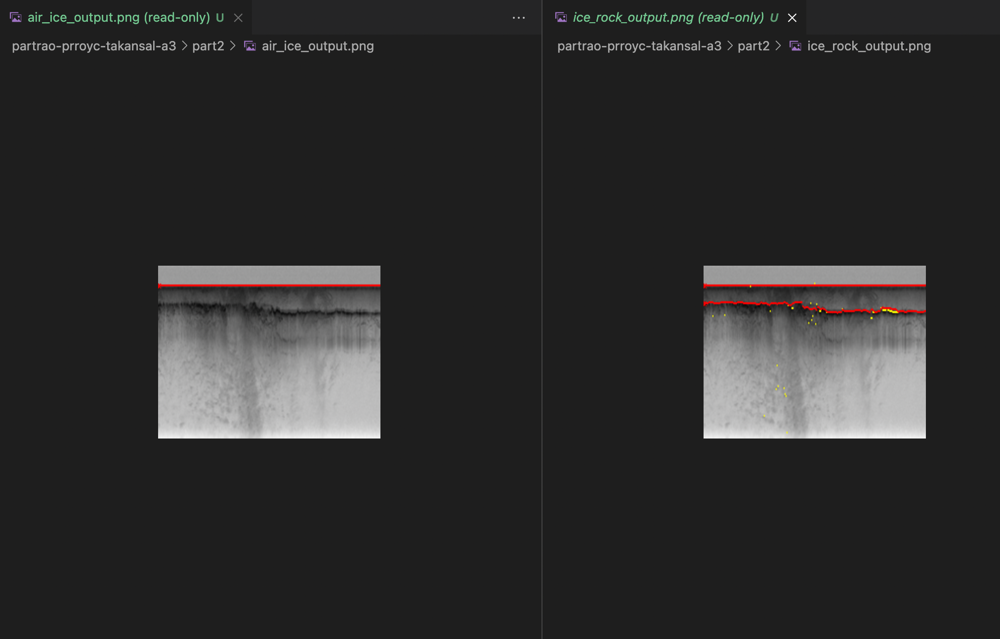

# Part 1: Part-of-speech tagging

A basic problems in Natural Language Processing is part-of-speech tagging, in which the goal is to mark every word in a sentence with its part of speech (noun, verb, adjective, etc.). Sometimes this is easy: a sentence like "Blueberries are blue" clearly consists of a noun, verb, and adjective, since each of these words
has only one POSsible part of speech (e.g., "blueberries" is a noun but can't be a verb).

But in general, one has to look at all the words in a sentence to figure out the part of speech of any individual word. For example, consider the | grammatically correct! | sentence: "Buffalo buffalo Buffalo buffalo buffalo buffalo Buffalo buffalo." To figure out what it means, we can parse its parts of speech:
                             
               Buffalo    buffalo   Buffalo  buffalo  buffalo  buffalo  Buffalo  buffalo.
               Adjective   Noun    Adjective  Noun      Verb     Verb  Adjective  Noun

(In other words: the buffalo living in Buffalo, NY that are buffaloed (intimidated) by buffalo living in Buffalo, NY buffalo (intimidate) buffalo living in Buffalo, NY.)
That's an extreme example, obviously. Here's a more mundane sentence:

               Her POSition covers a   number   of  daily tasks  common to    any   social director.
               DET   NOUN    VERB DET   NOUN    ADP  ADJ   NOUN    ADJ  ADP   DET      ADJ   NOUN

where DET stands for a determiner, ADP is an adPOSition, ADJ is an adjective, and ADV is an adverb. Many of these words can be different parts of speech: "POSition" and "covers" can both be nouns or verbs, for example, and the only way to resolve the ambiguity is to look at the surrounding words. Labeling parts of speech thus involves an understanding of the intended meaning of the words in the sentence, as well as the relationships between the words.

Fortunately, statistical models work amazingly well for NLP problems. Consider the Bayes net shown in Figure 1(a). This Bayes net has random variables *S = {S1,...,SN}* and *W = {W1,...,WN}*. The W's represent observed words in a sentence. The S's represent part of speech tags, so Si ∈ {VERB,NOUN,...}. The arrows between W and S nodes model the relationship between a given observed word and the POSsible parts of speech it can take on, *P*(*Wi*|*Si*). (For example, these distributions can model the fact that the word "dog" is a fairly common noun but a very rare verb.) The arrows between S nodes model the probability that a word of one part of speech follows a word of another part of speech, *P*(*Si+1*|*Si*). (For example, these arrows can model the fact that verbs are very likely to follow nouns, but are unlikely to follow adjectives.)

**Data:** There is a large corpus of labeled training and testing data available for this problem. Each line consists of a sentence, and each word is followed by one of 12 part-of-speech tags: **ADJ** (adjective), **ADV** (adverb), **ADP** (adPOSition), **CONJ** (conjunction), **DET** (determiner), **NOUN**, **NUM** (number), **PRON** (pronoun), **PRT** (particle), **VERB**, **X** (foreign word), and **.** (punctuation mark).


**What to do?** The goal in this part is to implement part-of-speech tagging in Python, using Bayes networks.
1. To get started, consider the simplified Bayes net in Figure 1(b). To perform part-of-speech tagging, we'll want to estimate the most-probable tag si* for each word Wi, si* = argmax *P*(*Si* = *si*|*W*). Implement part-of-speech tagging using this simple model.
2. Now consider Figure 1(a), a richer Bayes net that incorporates dependencies between words. Implement Viterbi to find the maximum a POSteriori (MAP) labeling for the sentence, (s1,...,sN) = argmax P(Si = si|W).
3. Consider the Bayes Net of Figure 1(c), which could be a better model because it incorporates richer dependencies between words. But it's not an HMM, so we can't use Viterbi. Implement Gibbs Sampling to sample from the POSterior distribution of Fig 1(c), *P(S|W)*. Then estimate the best labeling for each word (by picking the maximum marginal for each word, si* = argmax *P*(*Si* = *si*|*W*). (To do this, just generate many (thousands?) of samples and, for each individual word, check which part of speech occurred most often.)

The program should take as input a training filename and a testing filename. The program should use the training corpus to estimate parameters, and then display the output of Steps 1-3 on each sentence in the testing file. For the result generated by each of the three approaches (Simple, HMM, Complex), as well as for the ground truth result, the program should output the logarithm of the joint probability *P(S,W)* for each solution it finds under each of the three models in Figure 1. It should also display a running evaluation showing the percentage of words and whole sentences that have been labeled correctly so far. For example:

```
[prataprc94@Prataps-MacBook-Pro part1 % python3 label.py bc.train bc.test.tiny 
Learning model...
Loading test data...
Testing classifiers...
                  Simple     HMM Complex poet  twisted again and   nick's knuckles scraped on    the   air   tank  ,     ripping off   the   skin  .    
0. Ground truth  -129.31 -125.10 -217.72 noun  verb    adv   conj  noun   noun     verb    adp   det   noun  noun  .     verb    prt   det   noun  .    
      1. Simple  -129.31 -125.10 -217.72 noun  verb    adv   conj  noun   noun     verb    adp   det   noun  noun  .     verb    prt   det   noun  .    
         2. HMM  -129.31 -125.10 -217.72 noun  verb    adv   conj  noun   noun     verb    adp   det   noun  noun  .     verb    prt   det   noun  .    
     3. Complex  -129.31 -125.10 -220.53 noun  verb    adv   conj  noun   noun     verb    adp   det   noun  noun  .     verb    adp   det   noun  .    

==> So far scored 1 sentences with 17 words.
                   Words correct:     Sentences correct: 
   0. Ground truth:      100.00%              100.00%
         1. Simple:      100.00%              100.00%
            2. HMM:      100.00%              100.00%
        3. Complex:       94.12%                0.00%
```
To get started, a skeleton code is already implemented in three files: label.py, which is the main program, POS_scorer.py, which has the scoring code, and POS_solver.py, which will contain the actual part-of-speech estimation code. Only the latter of these files shpould be modified; the current version of POS_solver.py is very simple, as you'll see. In the report, please make sure to include the results (accuracies) for each technique on the test file  supplied, **bc.test**. The code should finish within about 10 minutes.

## Solution

As per the above mentioned strategies, the Part of Speech tagging is achieved by using the following algortihms:
1. Simplified Model
2. HMM - Viterbi Algorithm
3. Markov chain Monte Carlo(using Gibbs Sampling)

**Training the Data :** To learn and calculate all the initial/emission/transition counts and probabilities for each of the 3 methods, the given training dataset **bc.train** has been processed. Followings are the probabilities calculated in training function **train(self, data)**:
* The probability that a particular POS comes as the first POS in a sentence
* The probability that a particular POS follows a given POS
* The probability of word given POS

While training and creating the transition probabilities of a POS tags, we also generated a table *P(Sn*|*Sn-1,S1)* for the calculation of Gibbs sampling in order to sample values from the Posterior distribution.
* *P(S1)* is proportional to *P(S1)*x*P(S2|S1)*x*P(W1|S1)*x*P(Sn|Sn-1,S1)*
* *P(Sn)* is proportional to *P(Wn|Sn)*x*P(Sn|Sn-1,S1)*
* *P(Sn-1)* is proportional to *P(Wn-1|Sn-1)*x*P(Sn|Sn-1,S1)*x*P(Sn-1|Sn-2)* - referring the figure 1(c)

### Algorithm

1. **Model Simplified:** Being so simple, it returns more than 90% accuracy for words correctly tagged. In this algorithm we follow basics of Bayesian Network.
   1. For each word in the sentence, we check for each POS and select the best among them and consider each word to be independent. From the training the data, we have the prior probabilities ie. P(Word|POS).
   2. For a selected word, we comapare the probability for each POS given this word and multiply it with the emission probability of the POS. As per the definition, the POS tag with the maximum probability seems to be the best suited tag for the selected word.
   3. The POS tag and the corresponding posterior probability are returned, where the posterior probability is used to calculated the Posterior probability for a given document in **posterior(self, model, sentence, label)** function.
 
 **Assumptions:** Usually a meaningful word when occurs-first in a sentence or occuring first time in a sentence and if it's POS tag is not recorded in prior, then assigning NOUN tag to it gives the best result.

2. **Model HMM - VITERBI:** To find the best POS tag sequence, given sentence (or a word sequence), we need to compare all the POS tag sequences. The best way to do this dynamically and faster is to use Viterbi method.
   1. For the first word of each sentence, the Viterbi coefficient depend only on the probability that a POS tag comes first in a sentence which is our initial state probability and the prior probability of the word given a POS tag. To store the Viterbi coefficients, a viterbi table in matrix form is maintained which is a forward matrix. Going forward, each row corresponds to the following words and the columns are the viterbi coefficients for each POS tag.
   2. For the following words -  Emission probability, Transition probability and the cost which is nothing but the Viterbi coefficient of the previous POS state that maximizes the probability of POS tag of previous word are used. For any given POS tag, we take the maximum of the (transition probability from a POS * previous viterbi coefficient of it) and multiply it with the emission probability of that word given a POS tag.
   3. Following the above steps, we get a viterbi table having the viterbi coefficients of each POS tag for the words row-wise and also a maximum decision table that stores the maximizing viterbi coefficient of each POS tag for all the words. Now selecting the maximum viterbi coefficient of the last word and returning it's corresponding POS tag, we do the backtracking in maximum decision table in such a way that it selects the most probable POS tag which maximizes the next word's viterbi coefficient. Thus, backtracking till the first word, we get a path which represents the best suited POS tags for the words in a given sentence.

3. **Model Complex - MCMC Gibbs Sampling:** 
   1. In Gibbs sampling, here we generated 1000 samples. For each sample,change one observed value and keeping all other observed value as constant, we get 12 probabilities for that observation - for all the 12 POS tags. All these 12 observed probabilities are then normalized. 
   2. Now for a given sequence, we check for all the 12 observed probability values that, at which range ie. at which POS tag, the cumulative sum of the observed probability is greater than a random bias chosen between 0 and 1. We assign that particular POS tag where the cummulative sum exceeds the random bias. This process is performed for all the word sequence in a sentence and that completes a single sample.
   3. For MAX marginalization, we generate 1000 samples and we calculate the marginal proababilities for each POS tag and return the best tag with highest probability for a particular word for each sample. Finally, once all the 100 samples are processed, the most common POS tag with its posterior probability calculated over the 1000 samples generated are returned for the output.
 
### **Sample Output**

```
prataprc94@Prataps-MacBook-Pro part1 % python3 label.py bc.train bc.test     
Learning model...
Loading test data...
Testing classifiers...
----
                  Simple     HMM Complex it's  late  and   you   said  they'd be    here  by    dawn  ''    .    
0. Ground truth   -82.86  -77.41 -127.30 prt   adv   conj  pron  verb  prt    verb  adv   adp   noun  .     .    
      1. Simple   -82.86  -77.41 -125.53 prt   adj   conj  pron  verb  prt    verb  adv   adp   noun  .     .    
         2. HMM   -82.86  -77.41 -125.53 prt   adj   conj  pron  verb  prt    verb  adv   adp   noun  .     .    
     3. Complex   -82.86  -77.41 -125.53 prt   adj   conj  pron  verb  prt    verb  adv   adp   noun  .     .    

==> So far scored 2000 sentences with 29442 words.
                   Words correct:     Sentences correct: 
   0. Ground truth:      100.00%              100.00%
         1. Simple:       93.95%               47.60%
            2. HMM:       95.71%               58.10%
        3. Complex:       94.53%               51.15%

```
**Run time:** The program has been tracked and it finishes within 9 minutes to predict the POS tags for 2000 documents in the test data set with 1000 samples generating for Complex-MCMC method.


# Part 2: Ice tracking

In this problem, we'll help solve global warming. :)

To understand how rising global temperatures affect ice at the Earth's north and south poles, glaciologists need information about the structure of the ice sheets. The traditional way of doing this is to drill into the ice and remove an ice core. But a single ice core can take many months to drill, and only gives information about the ice at a single latitude-longitude point. To expedite this process, scientists have developed radar systems that allow an airplane to collect an approximate \cross section" of the ice below the airplane's flight path (Fig 2a). This produces a radar echogram like the one shown in Fig 2b. The horizontal axis is the distance along the  flight path, while the vertical axis is the depth below the plane. The echogram shows two prominent features. One is the very dark line near the top, which is the boundary between the air and the ice. There's also a deeper line which shows the boundary between the ice and the bedrock. Fig 2c shows the same echogram but with the air-ice (red) and ice-rock  green) boundaries manually labeled. These echograms reveal the complex structure of the ice - note the ridges and valleys in the bedrock in Fig 2c, for example - and contain rich information for glaciologists to calculate volumes of ice and to estimate how it will change with warming temperatures. But as you can see from the figure, these echograms are also extremely noisy, so finding the layer boundaries is quite challenging. Even human experts, when presented with the same echogram, often disagree on where the boundaries are.

In this part, we'll create code to try to find these two boundaries (air-ice and ice-rock). We'll make some assumptions to make this possible. First, you can assume that the air-ice boundary is always above the ice-rock boundary by a significant margin (say, 10 pixels). Second, you can assume that the two boundaries span the entire width of the image. Taken together these, two assumptions mean that in each column of the image, there is exactly one air-ice boundary and exactly one ice-rock boundary, and the ice-rock boundary is always below. Third, we assume that each boundary is relatively "smooth" - that is, a boundary's row in one column will be similar in the next column. Finally, you can assume that the pixels along the boundaries are generally dark and along a strong image edge (sharp change in pixel values).

We've given you code that reads an image file into a two-dimensional array. For an *m x n* echogram, the code creates a 2-d array *I(x,y)* that stores the radar return at each pixel (x,y) ∈ [1,m] x [1,n] where smaller values indicate greater probability of a boundary. Your goal is to estimate, for each column x ∈ [1,m], the row ax corresponding to the air-ice boundary, and the row rx corresponding to the ice-rock boundary. (In image processing, the coordinate system convention is for the upper-left of the image to be the point (1,1), and for column indices to increase as you go right and row indices to increase as you go down.) Each of these boundaries can be solved for using a Bayes net. For example, for the air-ice problem, the Bayes net would have hidden variables a1,a2,...,am, and observed variables (specifically w1,w2,...,wm, where w1 is a vector corresponding to column 1 of the image).


Since the air-ice boundary is generally stronger than ice-rock and easier to estimate, it makes sense to first estimate the air-ice boundary, and then estimate the ice-rock boundary but require that it be at least (for example) 10 pixels below the air-ice boundary in each column (i.e., require that rx ≥ ax + 10 for all x ∈ [1, m]).
1. Perhaps the simplest technique would be to use the Bayes’ Net in Figure 1(b) to estimate the two boundaries. Implement this technique, showing the boundaries in yellow. 
(Hint: What should your emission probabilities look like? This is for you to decide, but intuitively a stronger edge and/or darker (lower) pixel value should correspond to higher probability. Our skeleton code includes a function to compute edge strength, in case this is helpful.)
2. A better approach would use the Bayes Net in Figure 1(a). Use Viterbi, showing the boundaries in blue.
(Hint: What should your transition probabilities look like? It’s up to you, but you probably want to use a distribution that encourages “smoothness,” i.e. that *P(si+1|si)* is high if *si+1* = *si* and is low if they are very different.)
3. A simple way of improving the results further is to incorporate some human feedback. Assume that a human gives you two *(x,y)* points, one that is known to lie somewhere on the air-ice boundary, and one that is known to lie somewhere on the ice-rock boundary. Modify your answer to step 2 to incorporate this additional information.
(Hint: you can do this by just tweaking the HMM’s probability distributions – no need to change the algorithm itself!) Show the resulting boundaries in red and the human-provided point with an asterisk (our skeleton code already does this for you).

Your program should be run like this:
```
python3 ./polar.py input_file.jpg airice_row_coord airice_col_coord icerock_row_coord icerock_col_coord
```
where *airice_row_coord* and *airice_col_coord* are the image row and column coordinates of the human-labeled air-ice pixel, and *icerock_row_coord* and *icerock_col_coord* are the coordinates of the human-labeled ice-rock pixel. The program should generate two files: air_ice_output.jpg, which should show the original image
with the yellow, blue, and red lines superimposed on the echogram for the estimated air-ice layers, and ice_rock_output.jpg, which should show the same for the ice-rock layers.
Run the code on the sample images and please show a few sample outputs in the report.

## Solution

The basic problem is to keep the track of ice height in polar regions to get the estimate for increasing temperature. We have to detect the boundary of air-ice and ice-rock from the radar echogram.

**Assumptions:** 
1. The air-ice boundary is always above the ice-rock boundary by a significant margin (say, 10 pixels) i.e. vertical distance between air-ice and ice-rock pixel is atleast 10.
2. The two boundaries span the entire width of the image i.e. pixel for boundary exists in every column of the image grid.
3. We assume that each boundary is relatively “smooth” — that is, a boundary’s row in next column has the high probabiltity of being.

### Algorithm

1. **Method 1 - Using Bayes Net:** 
   1. In this technique, we simply selected the maximum from each column(edge matrix) and considered it as the most probable pixel to be part of the boundary.
   2. Then, after estimating the air-ice boundary, and considering the assumption that there is at least 10 pixel vertical distance between air-ice and ice-rock boundary, we took the edge pixel with maxiumum value from the array[ airIceBoundary[i]: ] i.e. from column number 10 down of air-ice boundary.
   3. Yellow Line shows the boundary output for bayes net.


2. **Method 2 - Using Viterbi:** For viterbi algorithm, we need the following probabilities into consideration:
   1. Initial Probability - The pixel with maximum edge value is considered as initial point and set its probability to 1
   2. Transition Probabilities - The assumption that the boundary is smooth has been considered. So, in the range of 15, we assumed probabilites for the pixels in the same row for next column. The farthest the pixel, the lesser the probability.
   3. Emission Probabilites -  The edge values are considered as the emission probabilites (as those are the observed values). These are normalised to keep between the range of 0-1.
   4. Once all the probability values are available, the boundary indexes are calculated for air-ice boundary by viterbi algorithm.
   5. After getting the air-ice boundary indexes, to calculate the ice-rock boundary, the minimum vertical distance is considered to be 10. Appling the same process(viterbi)to pixels down 10 to air-ice boundary, to detect the ice-rock boundary.
   6. Blue Line shows the boundary output for viterbi algorithm.

3. **Method 2 - Considering Human Coordinates:** This is a modification to Viterbi process, wherein we consider some human Coordinates to be provided as one pixel on the boundary, and start our algorithm from that point.
   1. We are provided with value for any column , so we need to find the values for (0-column) and (column+1 - totalColumns).
   2. After having all the required values, the boundary indexes for air-ice boundary is calculated by viterbi algorithm(forward and backward).
   3. Same process is applied for detecting the ice-rock boundary.
   4. Red Line shows the boundary output for viterbi algorithm.

### **Sample Output**

```
prataprc94@Prataps-MacBook-Pro part2 % python3 polar.py test_images/30.png 0 20 0 58
```

```
prataprc94@Prataps-MacBook-Pro part2 % python3 polar.py test_images/31.png 0 25 0 66
```

```
prataprc94@Prataps-MacBook-Pro part2 % python3 polar.py test_images/16.png 0 20 0 38
```


# Part 3: Reading text

To show the versatility of HMMs, let's try applying them to another problem; if you're careful and you plan ahead, you can probably re-use much of your code from Parts 1 and 2 to solve this problem. Our goal is to recognize text in an image - e.g., to recognize that Figure 3 says "It is so ordered." But the images are noisy, so any particular letter may be diffcult to recognize. However, if we make the assumption that these images have English words and sentences, we can use statistical properties of the language to resolve ambiguities, just like in Part 2.


We'll assume that all the text in our images has the same fixed-width font of the same size. In particular, each letter fits in a box that's 16 pixels wide and 25 pixels tall. We'll also assume that our documents only have the 26 uppercase latin characters, the 26 lowercase characters, the 10 digits, spaces, and 7 punctuation symbols, (),.-!?'". Suppose we're trying to recognize a text string with n characters, so we have n observed variables (the subimage corresponding to each letter) *O1,...,On* and n hidden variables, *l1,...,ln*, which are the letters we want to recognize. We're thus interested in *P(l1,...,ln|O1,...,On)*. As in part 1, we can rewrite this using Bayes' Law, estimate *P(Oi|li)* and *P(li|li-1)* from training data, then use probabilistic inference to estimate the posterior, in order to recognize letters.

**What to do?**- Write a program called **image2text.py** that is called like this:
```
python3 ./image2text.py train-image-file.png train-text.txt test-image-file.png
```
The program should load in the train-image-file, which contains images of letters to use for training (we've supplied one for you). It should also load in the text training file, which is simply some text document that is representative of the language (English, in this case) that will be recognized. (The training file from Part 1 could be a good choice). Then, it should use the classifier it has learned to detect the text in test- image-file.png, using (1) the simple Bayes net of Figure 1b and (2) the HMM of Fig 1a with MAP inference (Viterbi). The last two lines of output from your program should be these two results, as follows:

```
python3 ./image2text.py train-image-file.png train-text.txt test-image-file.png
Simple: 1t 1s so orcerec.
HMM: It is so ordered.
```
**Hints**- A skeleton code that takes care of all the image I/O is supplied, so you don't have to worry about any image processing routines. The skeleton code converts the images into simple Python list-of-lists data structures that represents the characters as a 2-d grid of black and white dots. You'll need to define an HMM and estimate its parameters from training data. The transition and initial state probabilities should be easy to estimate from the text training data. For the emission probability, we suggest using a simple naive Bayes classifier. The train-image-file.png file contains a perfect (noise-free) version of each letter. The text strings your program will encounter will have nearly these same letters, but they may be corrupted with noise. If we assume that m% of the pixels are noisy, then a naive Bayes classifier could assume that each pixel of a given noisy image of a letter will match the corresponding pixel in the reference letter with probability (100 - m)%.

## Solution

The aim of this part is to carry out Optical Character Recognition on text-based images using Naïve Bayes Classifier (Bayes Net) and Hidden Markov Model with MAP inference (Viterbi). 

**Data Preprocessing :** It is suggested that a text training file **bc.train** from Part 1 be used, which is representative of the English language. Since **bc.train** has been taken from Part 1, the file has a number of words and special characters such as parts of speech etc that are not required for Part 3. We handle this in the **TextPreprocessing(file)** function, where the POS tokens, and other characters are replaced.

**Probability Distribution**

* **Initial Probability:** The number of times a sentence begins with a particular number is stored in the form of a dictionary. This is calculated in the **FindInitProb(train_doc, temp_letter)** function. The values are normalized. The function returns the initial probability for the required letter.
* **Transition Probability:** Here the probability of the occurrence of all letters given a particular letter is calculated and stored. It is stored in the form of a dictionary of dictionaries. These values are also normalized.
* **Emission Probability:** For the emission probability, we have used a simple Naïve Bayes Classifier. If we assume that m% of the pixels are noisy, then a naive Bayes classifier could assume that each pixel of a given noisy image of a letter will match the corresponding pixel in the reference letter with probability (100 - m)%.

### Algorithm

1. **Bayes Net:** 
   1. This is done using function **naive_bayes(test_char, train_char, m)**.
   2. Looping through each letter in the noisy image that is given to identify as test_char, we iterate through all the letters available and calculate the emission probability for a letter, given the noisy image letter.
   3. The emission probability of each letter is compared, and the letter with the best emission probability is added to a variable holding the best letters/characters.

2. **HMM with Viterbi:**
   1. The initial probabilities are calculated in **hmm_viterbi(test_char, train_char, processed_char, m)** for all the actual letters (hidden states), for the image of the noisy letter observed.
   2. The transition probabilities and the emission probabilities are calculated for each state.
   3. Once we have all the probabilities, we use the Viterbi algorithm to calculate the best sequence of letters.
   4. For implementing Viterbi, we have used log probabilities, as we got better results with it.

### **Sample Output**


```
C:\Users\parth\Documents\IU\EAI551\partrao-prroyc-takansal-a3\part3> python3 ./image2text.py test_images/courier-train.png bc.train test_images/test-5-0.png
Simple: Opinion of the Ccurt
   HMM: Opinion of the Court
```

```
C:\Users\parth\Documents\IU\EAI551\partrao-prroyc-takansal-a3\part3> python3 ./image2text.py test_images/courier-train.png bc.train test_images/test-13-0.png
Simple: exc1uded from one of civi1ization's o1dest institutions.
   HMM: exc1uded from one of civi1ization's o1dest institutions.
```

```
C:\Users\parth\Documents\IU\EAI551\partrao-prroyc-takansal-a3\part3> python3 ./image2text.py test_images/courier-train.png bc.train test_images/test-15-0.png
Simple: The Constitut1on grants them that r1ght.
   HMM: The Constitution grants them that right.
```


